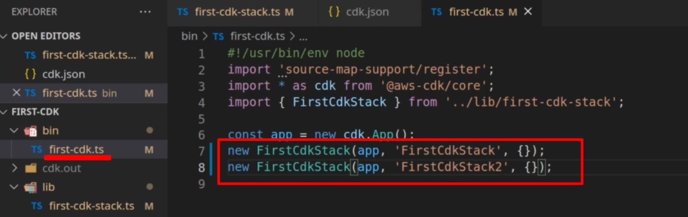
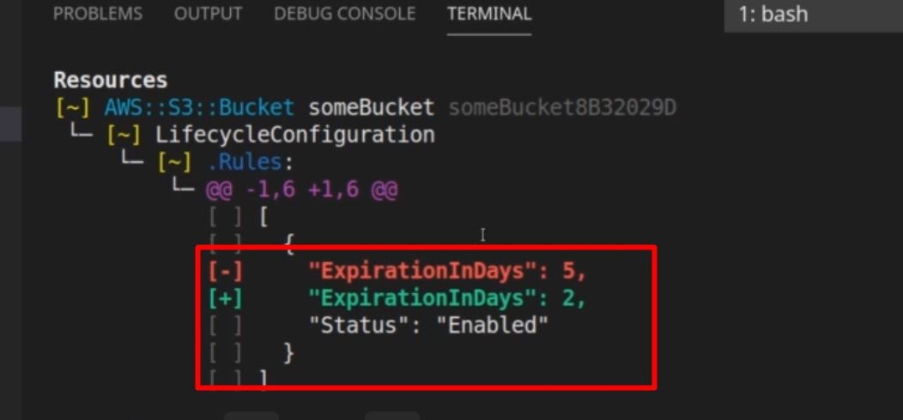
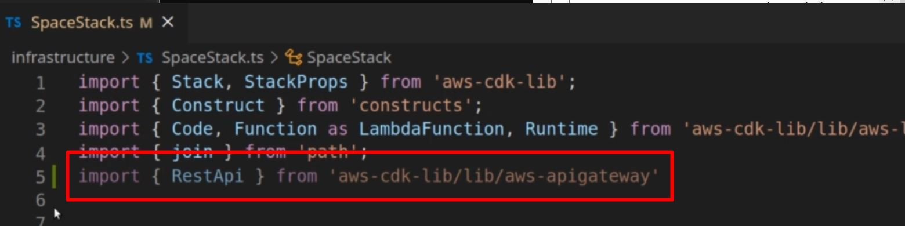
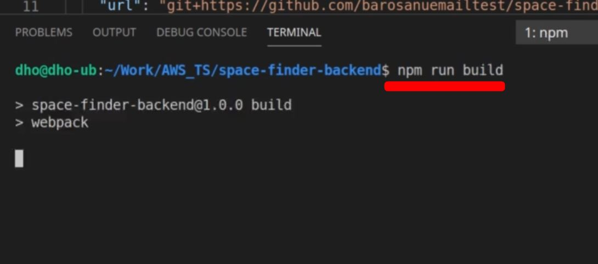
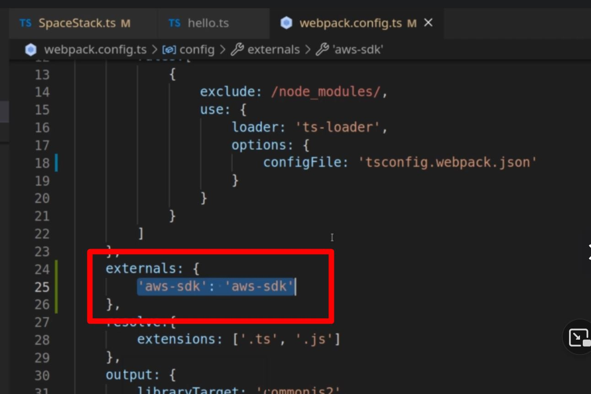

# AWS + TS Masterclass

### Lesson 1 - AWS CDK and CloudFormation

Expand

##### 1.1 AWS CDK cool presentation
1. Things to remember
    1. CDK is
        1. Reuseable version of CloudFormation
        1. Easier to read than CloudFormation
        1. Available in
            1. Python
            1. C#
            1. TS

##### 1.2 AWS CloudFormation
1. Verify if CDK is properly running
    1. AWS CLI
        1. 
    1. AWS CDK
        1. 

1. Initialize within TS
    1. 
        1. `cdk init app --language typescript`
1. Define your Stack within initialized folder
    1. `bin` folder
        1. place where cdk is initialized with `new cdk.App()`
        1. 
    1. `lib` folder 
        1. place where `CdkStack` is defined
        1. 
        1. 
    1. `jest.config.js`
        1. 
1. `cdk synth` to generate CloudFront `.json` files
    1. 
        1.  
1. `cdk bootstrap` to send stack metadata to your AWS account
    1. 
        1. 
1. `cdk deploy`
    1. 
        1. 

##### 1.4 CDK Project exploration
1. CDK configuration file - `cdk.json`
    1. 
        1.  `"app"` holds the running command when CDK starts
        1. note that it runs `ts-node` which DOES NOT read JS... just pure TS
1. `bin` cdk.ts
    1. 
        1.  This is where deployment properties are set
    1. Also you can deploy MULTIPLE stacks from this file
        1. 
            1. 
1. `lib` stack.ts
    1. 
        1.  This is where stack definitions go

1. Inserting custom CDK S3 commands
    1. Install S3 library
        1. 
    1. Import
        1. 
    1. Implement
        1. 
    1. Merely adding `{}` allows to pull a list of CDK properties
        1. 
    1. Don't forget to import 
        1. 
    1. `cdk deploy`

##### 1.5 AWS CDK types and commands
1. `cdk deploy`
    1. `cdk deploy SpecificStack` 
        1. 
    1. 
        1. 
1. `cdk list`
    1. lists available stacks IN THE `cdk.out`
        1. 
    1. 
1. `cdk diff`
    1. shows recent changes in bucket
        1. 
1. `cdk destroy`
    1. destroys SPECIFIED stack
        1. 
        1. 
1. `cdk doctor`
    1. tells us if there are problems with stacks
        1. 

##### 1.6 AWS CDK outputs
1. What are outputs?
    1. Metadata about name of generated stack resources
        1. allows you to recall names of stack resources WITHOUT having to go through the console
1. What does an output look like?
    1. In code
        1. 
    1. In output
        1. 
    1. In AWS Console
        1. 

##### 1.7 CDK Deployment parameters
1. What are Parameters
    1. Allows for changes to stacks that are already deployed
1. Import and utilize
    1. 
    1.  
1. Checking output in AWS Console
    1. 
        1. 
1. Changing a parameter mid-deployment
    1. 
        1. 

##### 1.8 CDK core - recap
1. Best Reference when using AWS CDK... AWS CDK API reference
    1. 
1. All reference are `aws-nameOfAWSresource`
    1. 
1. Other Reference ... AWS CDK github page
    1. Always check for issues
        1. 

### Lesson 2 - Serverless project with CDK and TS

Expand

##### 2.1 AWS CDK Typescript project from scratch
1. What is good about CDK v2
    1. Allows for all constructs to be imported via one package

##### 2.2 CDK project implementation - part 2
1. Overview of Organization
    1. Try to maintain TS CDK logic within `infrastructure` folder
        1. Put Stack configuration/logic within `*Stack.ts` file
        1. Put CDK logic that runs Stack within `Launcher.ts` file
            1. 
1. Overview of starting a CDK project
    1. initialize GitHub project / checkout locally
    1. `npm init -y`
    1. `npm i -D aws-ckd aws-cdk-lib constructs ts-node typescript`
    1. create a separate folder holding the logic of CDK files
        1. folder
            1. 
        1. Stack configuration
            1. 
        1. Launcher configuration
            1. 
    1. modify `cdk.json`
        1. ` {
           "app":"npx infrastructure/Launcher.ts" 
        }`
            1. 
    1. initialize TS with `tsc init`
        1. 
    1. `synth` to get `tsconfig`
    1. 
        1. 
            1. 

##### 2.3 Basic AWS Lambda
1. Overview
    1. AWS Lambda 
        1. Must be kept separate from main logic
            1. consider putting it within a `services`
                1.  
    1. 
        1. 
            1. 
1. Basics of implementing Lambda Logic
    1. import `Function` from `aws-lambda`
        1. 
            1. 
    1. run `Function` from `aws-lambda` with:
        1. `runtime:` parameter, which provides options of 
            1. 
        1. `code:` parameter, which provides options of 
            1. 
        1. `handler:` parameter, which picks out what function of the file runs
            1.  
                1. 
    1. run `cdk synth` to see files
        1. 
            1. 

##### 2.4 AWS API Gateway and Lambda
1. Overview
    1. Implementing API Gateway
        1. Wrap `LambdaFunction` within an `Integration`
        1. Add a `private` api
        1. Within constructor, add a `RestApi` resource *with a name*
        1. Within constructor, Attach a method to resource *WITH AN HTTP VERB*
    1. Test via REST Client
        1. 
1. Implement API Gateway
    1. Import 
        1. `RestApi` from `aws-cdk-lib/lib/aws-apigateway`
            1. 
    1. Implement an integration
        1. Utilize ApiGateway's `LambdaIntegration` and wrap the Lambda Function in it
            1. 
    1. Add a resource to the `api.root`
        1. Utilize ApiGateway's `RestApi.root.addResource()` to create a resource called `'hello'`
            1. 
    1. Add integration to the named resource as a Method
        1. Utilize ApiGateways' `RestApi.root.addMethod` to tie the integration as a `Get` route
            1. 
1. Implement HTTP test
    1. Code a `.http` file
        1. 
    1. 
            1. 

##### 2.5 AWS DynamoDB with CDK
1. Overview
    1. Keep DynamoDB Logic separate
        1. 
    1. Remember your fundamental database interaction
        1. Variables
            1. name
            1. primaryKey
    1. Remember your stack
        1. Variable
            1. stack
    1. Remember to set an initialization function
        1. to organize the order of functions
            1. 
    1. Remember to add Database function
        1. to create Table
            1. 

1. Creating a Table
    1. Establishing Generic Table function
        1. establish private variables of table + stack
            1. 
        1. Establish initialization function to manage functions
            1. 
        1. Establish table creation within initialization
            1. utilize a new `Table` that takes in ...
                1. stack
                1. new name
                1. object with partitionKey / table name
            1. 
1. Implement table function within `*Stack.ts`
    1. Remember your parameters
        1. 

1. Check and deploy
    1. `cdk synth` and `cdk deploy`
        1. 

### Lesson 3 - Serverless Lambda - bundling testing

Expand

##### 3.1 Section intro

##### 3.2 Lambda bundling problem
1. Problem
    1. Webpack requires JS... NOT TS

1. Three possible solutions
    1. Monorepo
        1. Implementation
            1. Skip WebPack
            1. Send modules
        1. Pro
            1. Simplest solution 
        1. Con
            1. Loading of `node_modules` is slow
    1. Amazon's Node Lambda
        1. Implementation
            1. use Docker to load Amazon's version of Node
        1. Pro
            1. Faster than mono
        1. Con
            1. Experimental
    1. Webpack
        1. Implementation
            1. Configure
        1. Pro
            1. Smaller bundle and loading 
        1. Con
            1. Painful Configuration

##### 3.3 CDK Node Lambda
1. Intro
    1. CDK utilizes `esbuild` 
        1. try it locally so you know it works in AWS
        1. `npm install -D esbuild@0`
1. Building a Lambda with TS
    1. Building a new version of `hello.js`
        1. utilize `v4` of `uuid` to generate a random number
            1. 
1. Incorporating the `TS` within Stack
    1. `import` the `NodejsFunction` from `aws-lambda-nodejs`
        1. 
    1. Implement `NodejsFunction` to import and handle `.ts`
        1. 
1. Check if it works
    1. `cdk synth` to ensure it compiles
        1. 
    1. check if it is stored in Lambda
        1. 
    1. Test lambda
        1. 

            
##### 3.4 Webpack intro
1. Get dependencies
    1. 

1. Start configuration
    1. create `webpack.config.ts`
        1. Ensure to add
            1. `Configuration` from webpack
            1. `resolve` from `path`
        1. 
    1. Establish a Configuration Object
        1. Ensure to have the properties (MoET MoRe Out)
            1. `mode`
                1. 
            1. `entry`
                1. 
            1. `target`
                1. 
            1. `module`
                1. 
            1. `resolve`
                1. 
            1. `output`
                1. 
    1. Attach webpack within `package.json`
        1. 
    1. Test the build
        1. 

##### 3.5 Lambda Webpack setup
1. Side effects -- `*.d.ts`
    1. What it looks like
        1. 
    1. Solution - separate config file to target specific folder
        1. Create `tsconfig.webpack.json`
            1. 
        1. Connect `webpack.config.ts` to the new file within `ts-loader`'s `configFile`
            1. 
    1. Run and test
        1. 
        1. 

1. Connecting webpack to the Stack 
    1. Needs to be a LambdaFunction and *BEFORE* all others
        1. 
            1. 
1. Check it by deploying and running a Lambda on AWS
    1. 

1. Tree-shaking the largest dependency --> uuid
    1. 

### Lesson 4 Testing and debugging Lambdas

Expand

##### 4.1 Section intro
1. Overview
    1. Created a `hello.ts` Lmabda function
        1. 
    1. Will set a breakpoint
        1. 
    1. Write a test doc
        1. 
    1. Checking your breakpoint
        1. 
        1. Shows the buckets **WITHOUT RUNNING IT IN THE CLOUD**

##### 4.1 AWS CloudWatch logs
1. Implement `console.log()` within program, invoke and CloudWatch it
    1. `console.log()`
        1. 
    1. Go to cloudwatch
        1. 
    1. Review logs
        1. 
    1. Sending a request causes an error
        1. 

1. Adding permissions via `PolicyStatement`
    1. import `PolicyStatement` and add Action/Resources; attach lambda to role
        1. 
1. Verifying Lambda Permissions
    1. Go to specific Lambda function
        1. 
    1. Go to permissions
        1. 
    1. Go to actions
        1. 

##### 4.1 Using the AWS sdk
1. Setting up for local debugging
    1. Ensure `ts-node` is installed
    1. Add a new configuration
        1. 
    1. Auto-generates a `launch.json`
        1. 
    1. Configure it to run recursive on "ts-node/register"
        1. 
    1. 
        1. 
1. 
    1. 
        1. 
            1. 
    1. 
        1. 
            1. 

1. 
    1. 
        1. 
            1. 
    1. 
        1. 
            1. 
1. 
    1. 
        1. 
            1. 
    1. 
        1. 
            1. 

1. 
    1. 
        1. 
            1. 
    1. 
        1. 
            1. 

### Lesson 5 AWS DynamodBD with CDK and Lambda

Expand

##### 5.1 Section intro
1. 
    1. 
        1. 
            1. 
    1. 
        1. 
            1. 

1. 
    1. 
        1. 
            1. 
    1. 
        1. 
            1. 

##### 5.2 Put item
1. 
    1. 
        1. 
            1. 
    1. 
        1. 
            1. 

1. 
    1. 
        1. 
            1. 
    1. 
        1. 
            1. 

##### 5.3 Getting data from ApiGateway
1. 
    1. 
        1. 
            1. 
    1. 
        1. 
            1. 

1. 
    1. 
        1. 
            1. 
    1. 
        1. 
            1. 

##### 5.4 DynamoDb lambda initial setup
1. 
    1. 
        1. 
            1. 
    1. 
        1. 
            1. 

1. 
    1. 
        1. 
            1. 
    1. 
        1. 
            1. 

##### 5.5 DynamoDb lambda finish
1. 
    1. 
        1. 
            1. 
    1. 
        1. 
            1. 

1. 
    1. 
        1. 
            1. 
    1. 
        1. 
            1. 

##### 5.6 Scan operation
1. 
    1. 
        1. 
            1. 
    1. 
        1. 
            1. 

1. 
    1. 
        1. 
            1. 
    1. 
        1. 
            1. 

##### 5.7 Query operation
1. 
    1. 
        1. 
            1. 
    1. 
        1. 
            1. 

1. 
    1. 
        1. 
            1. 
    1. 
        1. 
            1. 

##### 5.8 Query on secondary indexes
1. 
    1. 
        1. 
            1. 
    1. 
        1. 
            1. 

1. 
    1. 
        1. 
            1. 
    1. 
        1. 
            1. 

##### 5.9 Update operation
1. 
    1. 
        1. 
            1. 
    1. 
        1. 
            1. 

1. 
    1. 
        1. 
            1. 
    1. 
        1. 
            1. 

##### 5.10 Delete operation
1. 
    1. 
        1. 
            1. 
    1. 
        1. 
            1. 

1. 
    1. 
        1. 
            1. 
    1. 
        1. 
            1. 

##### 5.11 Data validation
1. 
    1. 
        1. 
            1. 
    1. 
        1. 
            1. 

1. 
    1. 
        1. 
            1. 
    1. 
        1. 
            1. 

##### 5.12 Project small fixes
1. 
    1. 
        1. 
            1. 
    1. 
        1. 
            1. 

1. 
    1. 
        1. 
            1. 
    1. 
        1. 
            1. 

### Lesson 6 Securing API's with AWS Cognito

Expand

##### 6.1 Section intro
1. 
    1. 
        1. 
            1. 
    1. 
        1. 
            1. 

1. 
    1. 
        1. 
            1. 
    1. 
        1. 
            1. 

##### 6.2 AWS Cognito presentation
1. 
    1. 
        1. 
            1. 
    1. 
        1. 
            1. 

1. 
    1. 
        1. 
            1. 
    1. 
        1. 
            1. 

##### 6.3 Cognito in the AWS console
1. 
    1. 
        1. 
            1. 
    1. 
        1. 
            1. 

1. 
    1. 
        1. 
            1. 
    1. 
        1. 
            1. 

##### 6.4 Generating JWT tokens with AWS Amplify
1. 
    1. 
        1. 
            1. 
    1. 
        1. 
            1. 

1. 
    1. 
        1. 
            1. 
    1. 
        1. 
            1. 

##### 6.5 Using AWS Cognito tokens
1. 
    1. 
        1. 
            1. 
    1. 
        1. 
            1. 

1. 
    1. 
        1. 
            1. 
    1. 
        1. 
            1. 

##### 6.6 Understanding JWT tokens
1. 
    1. 
        1. 
            1. 
    1. 
        1. 
            1. 

1. 
    1. 
        1. 
            1. 
    1. 
        1. 
            1. 

##### 6.7 AWS Cognito with CDK: UserPool
1. 
    1. 
        1. 
            1. 
    1. 
        1. 
            1. 

1. 
    1. 
        1. 
            1. 
    1. 
        1. 
            1. 

##### 6.8 AWS Cognito with CDK: UserPoolClient
1. 
    1. 
        1. 
            1. 
    1. 
        1. 
            1. 

1. 
    1. 
        1. 
            1. 
    1. 
        1. 
            1. 

##### 6.9 Testing CDK with Cognito
1. 
    1. 
        1. 
            1. 
    1. 
        1. 
            1. 

1. 
    1. 
        1. 
            1. 
    1. 
        1. 
            1. 

##### 6.10 Access control with Cognito groups
1. 
    1. 
        1. 
            1. 
    1. 
        1. 
            1. 

1. 
    1. 
        1. 
            1. 
    1. 
        1. 
            1. 

### Lesson 7 AWS Cognito Identity pools

Expand

##### 7.1 Section intro
1. 
    1. 
        1. 
            1. 
    1. 
        1. 
            1. 

1. 
    1. 
        1. 
            1. 
    1. 
        1. 
            1. 

##### 7.2 AWS Cognito Identity pools in the console
1. 
    1. 
        1. 
            1. 
    1. 
        1. 
            1. 

1. 
    1. 
        1. 
            1. 
    1. 
        1. 
            1. 

##### 7.3 Getting AWS temporary credentials
1. 
    1. 
        1. 
            1. 
    1. 
        1. 
            1. 

1. 
    1. 
        1. 
            1. 
    1. 
        1. 
            1. 

##### 7.4 Identity pools in CDK
1. 
    1. 
        1. 
            1. 
    1. 
        1. 
            1. 

1. 
    1. 
        1. 
            1. 
    1. 
        1. 
            1. 

##### 7.5 IAM roles in CDK
1. 
    1. 
        1. 
            1. 
    1. 
        1. 
            1. 

1. 
    1. 
        1. 
            1. 
    1. 
        1. 
            1. 

##### 7.6 IAM role mappings
1. 
    1. 
        1. 
            1. 
    1. 
        1. 
            1. 

1. 
    1. 
        1. 
            1. 
    1. 
        1. 
            1. 

##### 7.7 Testing AWS temporary credentials
1. 
    1. 
        1. 
            1. 
    1. 
        1. 
            1. 

1. 
    1. 
        1. 
            1. 
    1. 
        1. 
            1. 

##### 7.8 Further features of AWS Cognito
1. 
    1. 
        1. 
            1. 
    1. 
        1. 
            1. 

1. 
    1. 
        1. 
            1. 
    1. 
        1. 
            1. 

### Lesson 8 Front-end for our Backend with React

Expand

##### 8.1 Section intro
1. 
    1. 
        1. 
            1. 
    1. 
        1. 
            1. 

1. 
    1. 
        1. 
            1. 
    1. 
        1. 
            1. 

##### 8.2 Create react app and git
1. 
    1. 
        1. 
            1. 
    1. 
        1. 
            1. 

1. 
    1. 
        1. 
            1. 
    1. 
        1. 
            1. 

##### 8.3 Base project structure
1. 
    1. 
        1. 
            1. 
    1. 
        1. 
            1. 

1. 
    1. 
        1. 
            1. 
    1. 
        1. 
            1. 

##### 8.4 Understanding state and props, child, parent
1. 
    1. 
        1. 
            1. 
    1. 
        1. 
            1. 

1. 
    1. 
        1. 
            1. 
    1. 
        1. 
            1. 

##### 8.5 First class component
1. 
    1. 
        1. 
            1. 
    1. 
        1. 
            1. 

1. 
    1. 
        1. 
            1. 
    1. 
        1. 
            1. 

##### 8.6 Child components
1. 
    1. 
        1. 
            1. 
    1. 
        1. 
            1. 

1. 
    1. 
        1. 
            1. 
    1. 
        1. 
            1. 

##### 8.7 Handling events
1. 
    1. 
        1. 
            1. 
    1. 
        1. 
            1. 

1. 
    1. 
        1. 
            1. 
    1. 
        1. 
            1. 

##### 8.8 Conditional rendering
1. 
    1. 
        1. 
            1. 
    1. 
        1. 
            1. 

1. 
    1. 
        1. 
            1. 
    1. 
        1. 
            1. 

##### 8.9 Data from child to parent
1. 
    1. 
        1. 
            1. 
    1. 
        1. 
            1. 

1. 
    1. 
        1. 
            1. 
    1. 
        1. 
            1. 

##### 8.10 Routing - NavBar
1. 
    1. 
        1. 
            1. 
    1. 
        1. 
            1. 

1. 
    1. 
        1. 
            1. 
    1. 
        1. 
            1. 

##### 8.11 Routing - Router
1. 
    1. 
        1. 
            1. 
    1. 
        1. 
            1. 

1. 
    1. 
        1. 
            1. 
    1. 
        1. 
            1. 

##### 8.12 Small Css
1. 
    1. 
        1. 
            1. 
    1. 
        1. 
            1. 

1. 
    1. 
        1. 
            1. 
    1. 
        1. 
            1. 

##### 8.13 State of the app
1. 
    1. 
        1. 
            1. 
    1. 
        1. 
            1. 

1. 
    1. 
        1. 
            1. 
    1. 
        1. 
            1. 

##### 8.14 Rendering async table: setup
1. 
    1. 
        1. 
            1. 
    1. 
        1. 
            1. 

1. 
    1. 
        1. 
            1. 
    1. 
        1. 
            1. 

##### 8.15 Rendering async table: adding rows
1. 
    1. 
        1. 
            1. 
    1. 
        1. 
            1. 

1. 
    1. 
        1. 
            1. 
    1. 
        1. 
            1. 

##### 8.16 Space component build
1. 
    1. 
        1. 
            1. 
    1. 
        1. 
            1. 

1. 
    1. 
        1. 
            1. 
    1. 
        1. 
            1. 

##### 8.17 Spaces component
1. 
    1. 
        1. 
            1. 
    1. 
        1. 
            1. 

1. 
    1. 
        1. 
            1. 
    1. 
        1. 
            1. 

##### 8.18 Routing and stiling spaces
1. 
    1. 
        1. 
            1. 
    1. 
        1. 
            1. 

1. 
    1. 
        1. 
            1. 
    1. 
        1. 
            1. 

##### 8.19 Modal content
1. 
    1. 
        1. 
            1. 
    1. 
        1. 
            1. 

1. 
    1. 
        1. 
            1. 
    1. 
        1. 
            1. 

##### 8.20 Display modal
1. 
    1. 
        1. 
            1. 
    1. 
        1. 
            1. 

1. 
    1. 
        1. 
            1. 
    1. 
        1. 
            1. 

### Lesson 9 Using AWS inside a React Project with Ampify

Expand

##### 9.1 Section intro
1. 
    1. 
        1. 
            1. 
    1. 
        1. 
            1. 

1. 
    1. 
        1. 
            1. 
    1. 
        1. 
            1. 

##### 9.2  Setup and Amplify install
1. 
    1. 
        1. 
            1. 
    1. 
        1. 
            1. 

1. 
    1. 
        1. 
            1. 
    1. 
        1. 
            1. 

##### 9.3 Cognito login from React code
1. 
    1. 
        1. 
            1. 
    1. 
        1. 
            1. 

1. 
    1. 
        1. 
            1. 
    1. 
        1. 
            1. 

##### 9.4 Amplify issue solved
1. 
    1. 
        1. 
            1. 
    1. 
        1. 
            1. 

1. 
    1. 
        1. 
            1. 
    1. 
        1. 
            1. 

##### 9.5 Photo bucket name and bucket CORS
1. 
    1. 
        1. 
            1. 
    1. 
        1. 
            1. 

1. 
    1. 
        1. 
            1. 
    1. 
        1. 
            1. 

##### 9.6 Passing the bucket ARN to Auth
1. 
    1. 
        1. 
            1. 
    1. 
        1. 
            1. 

1. 
    1. 
        1. 
            1. 
    1. 
        1. 
            1. 

##### 9.7 Lambda CORS
1. 
    1. 
        1. 
            1. 
    1. 
        1. 
            1. 

1. 
    1. 
        1. 
            1. 
    1. 
        1. 
            1. 

##### 9.8 Create space component
1. 
    1. 
        1. 
            1. 
    1. 
        1. 
            1. 

1. 
    1. 
        1. 
            1. 
    1. 
        1. 
            1. 

##### 9.9 AWS credentials in the browser
1. 
    1. 
        1. 
            1. 
    1. 
        1. 
            1. 

1. 
    1. 
        1. 
            1. 
    1. 
        1. 
            1. 

##### 9.10 Uploading public files
1. 
    1. 
        1. 
            1. 
    1. 
        1. 
            1. 

1. 
    1. 
        1. 
            1. 
    1. 
        1. 
            1. 

##### 9.11 Creating spaces
1. 
    1. 
        1. 
            1. 
    1. 
        1. 
            1. 

1. 
    1. 
        1. 
            1. 
    1. 
        1. 
            1. 

##### 9.12 Getting spaces
1. 
    1. 
        1. 
            1. 
    1. 
        1. 
            1. 

1. 
    1. 
        1. 
            1. 
    1. 
        1. 
            1. 

### Lesson 10 Application Deployment

Expand

##### 10.2 Section intro
1. 
    1. 
        1. 
            1. 
    1. 
        1. 
            1. 

1. 
    1. 
        1. 
            1. 
    1. 
        1. 
            1. 

##### 10.3 Deployment To S3 and CloudFront
1. 
    1. 
        1. 
            1. 
    1. 
        1. 
            1. 

1. 
    1. 
        1. 
            1. 
    1. 
        1. 
            1. 

##### 10.4 Discussion about finishing
1. 
    1. 
        1. 
            1. 
    1. 
        1. 
            1. 

1. 
    1. 
        1. 
            1. 
    1. 
        1. 
            1. 

##### 10.5 Exploring the finished app
1. 
    1. 
        1. 
            1. 
    1. 
        1. 
            1. 

1. 
    1. 
        1. 
            1. 
    1. 
        1. 
            1. 

### Lesson 11 Advanced usecases

Expand

##### 2.1 Intro
1. 
    1. 
        1. 
            1. 
    1. 
        1. 
            1. 

1. 
    1. 
        1. 
            1. 
    1. 
        1. 
            1. 

AWS recap
TS recap

