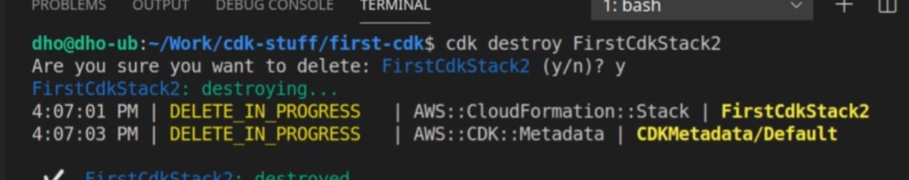
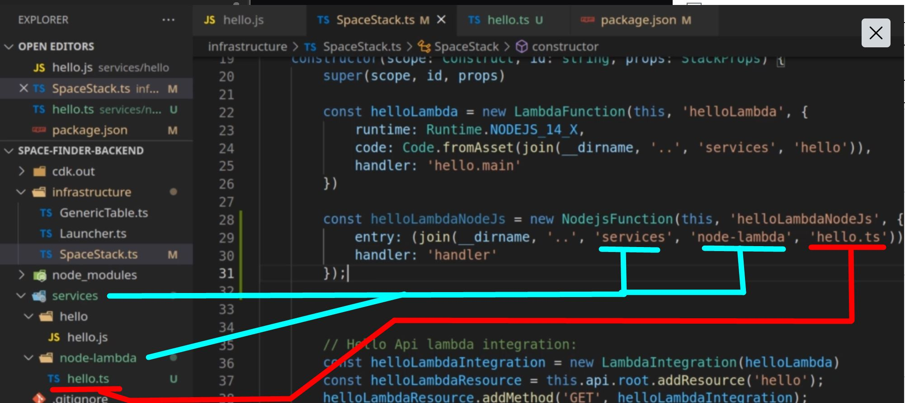
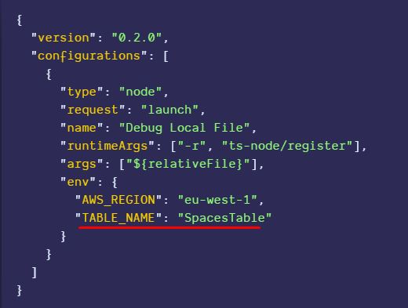
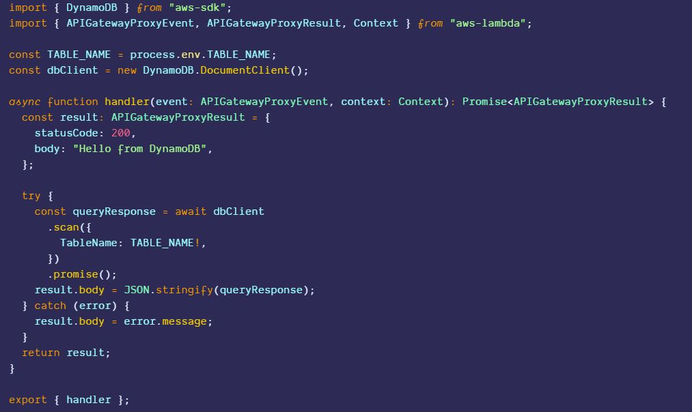
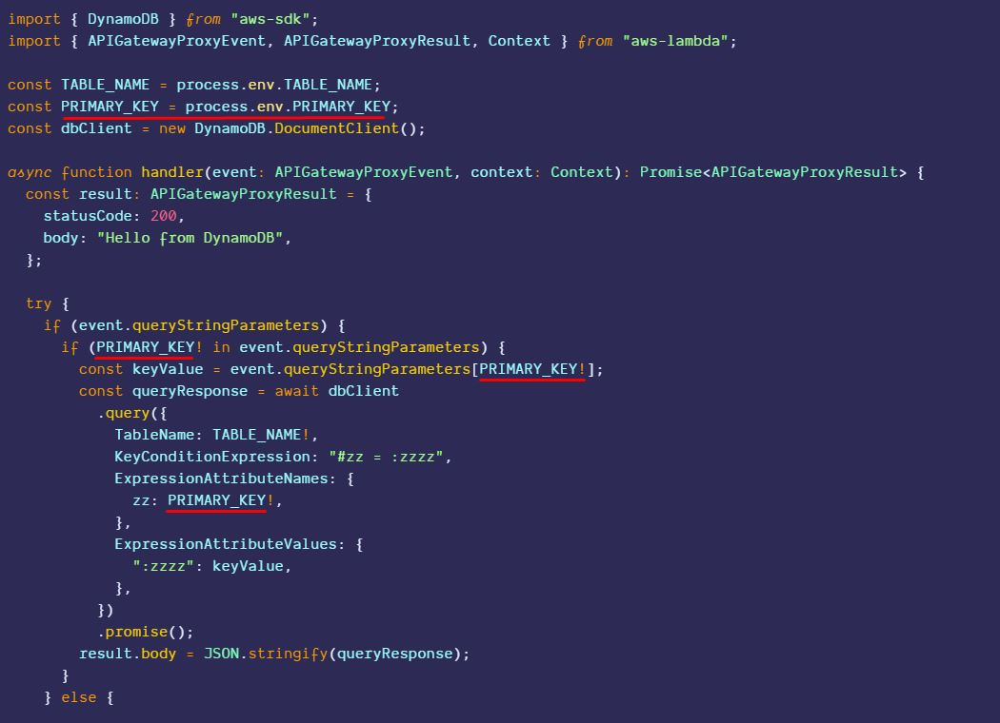
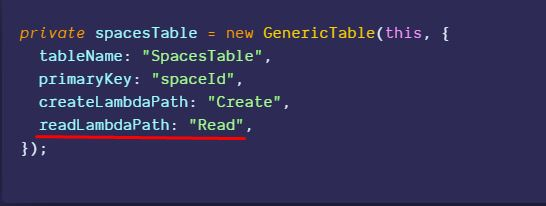
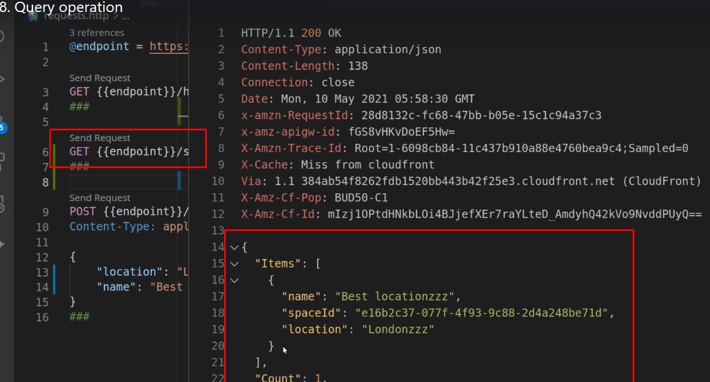
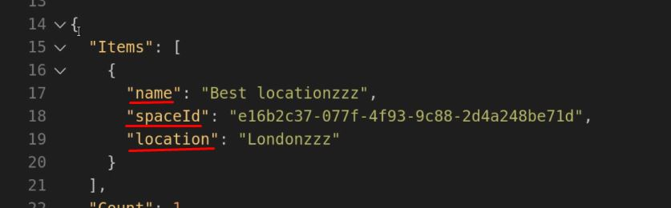
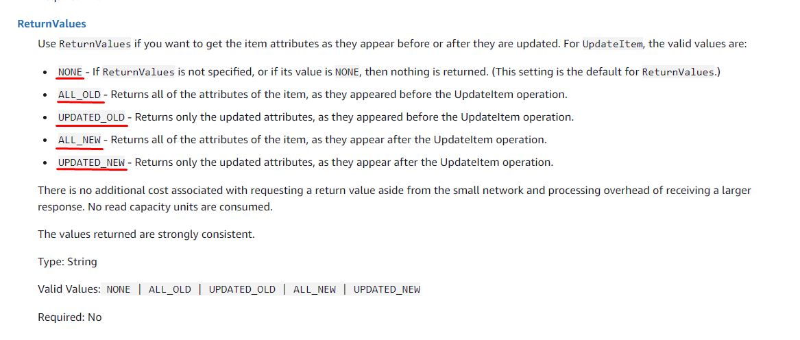

# AWS + TS Masterclass

### Lesson 1 - AWS CDK and CloudFormation

<details>
<summary>Expand</summary>


##### 1.1 AWS CDK cool presentation
1. Things to remember
    1. CDK is
        1. Reuseable version of CloudFormation
        1. Easier to read than CloudFormation
        1. Available in
            1. Python
            1. C#
            1. TS

##### 1.2 AWS CloudFormation
1. Verify if CDK is properly running
    1. AWS CLI
        1. 
    1. AWS CDK
        1. 

1. Initialize within TS
    1. 
        1. `cdk init app --language typescript`
1. Define your Stack within initialized folder
    1. `bin` folder
        1. place where cdk is initialized with `new cdk.App()`
        1. 
    1. `lib` folder 
        1. place where `CdkStack` is defined
        1. 
        1. 
    1. `jest.config.js`
        1. 
1. `cdk synth` to generate CloudFront `.json` files
    1. 
        1.  
1. `cdk bootstrap` to send stack metadata to your AWS account
    1. 
        1. 
1. `cdk deploy`
    1. 
        1. 

##### 1.4 CDK Project exploration
1. CDK configuration file - `cdk.json`
    1. 
        1.  `"app"` holds the running command when CDK starts
        1. note that it runs `ts-node` which DOES NOT read JS... just pure TS
1. `bin` cdk.ts
    1. 
        1.  This is where deployment properties are set
    1. Also you can deploy MULTIPLE stacks from this file
        1. 
            1. 
1. `lib` stack.ts
    1. 
        1.  This is where stack definitions go

1. Inserting custom CDK S3 commands
    1. Install S3 library
        1. 
    1. Import
        1. 
    1. Implement
        1. 
    1. Merely adding `{}` allows to pull a list of CDK properties
        1. 
    1. Don't forget to import 
        1. 
    1. `cdk deploy`


##### 1.5 AWS CDK types and commands
1. `cdk deploy`
    1. `cdk deploy SpecificStack` 
        1. 
    1. 
        1. 
1. `cdk list`
    1. lists available stacks IN THE `cdk.out`
        1. 
    1. 
1. `cdk diff`
    1. shows recent changes in bucket
        1. 
1. `cdk destroy`
    1. destroys SPECIFIED stack
        1. 
        1. 
1. `cdk doctor`
    1. tells us if there are problems with stacks
        1. 


##### 1.6 AWS CDK outputs
1. What are outputs?
    1. Metadata about name of generated stack resources
        1. allows you to recall names of stack resources WITHOUT having to go through the console
1. What does an output look like?
    1. In code
        1. 
    1. In output
        1. 
    1. In AWS Console
        1. 


##### 1.7 CDK Deployment parameters
1. What are Parameters
    1. Allows for changes to stacks that are already deployed
1. Import and utilize
    1. 
    1.  
1. Checking output in AWS Console
    1. 
        1. 
1. Changing a parameter mid-deployment
    1. 
        1. 


##### 1.8 CDK core - recap
1. Best Reference when using AWS CDK... AWS CDK API reference
    1. 
1. All reference are `aws-nameOfAWSresource`
    1. 
1. Other Reference ... AWS CDK github page
    1. Always check for issues
        1. 


</details>


### Lesson 2 - Serverless project with CDK and TS

<details>
<summary>Expand</summary>


##### 2.1 AWS CDK Typescript project from scratch
1. What is good about CDK v2
    1. Allows for all constructs to be imported via one package

##### 2.2 CDK project implementation - part 2
1. Overview of Organization
    1. Try to maintain TS CDK logic within `infrastructure` folder
        1. Put Stack configuration/logic within `*Stack.ts` file
        1. Put CDK logic that runs Stack within `Launcher.ts` file
            1. 
1. Overview of starting a CDK project
    1. initialize GitHub project / checkout locally
    1. `npm init -y`
    1. `npm i -D aws-ckd aws-cdk-lib constructs ts-node typescript`
    1. create a separate folder holding the logic of CDK files
        1. folder
            1. 
        1. Stack configuration
            1. 
        1. Launcher configuration
            1. 
    1. modify `cdk.json`
        1. ` {
           "app":"npx infrastructure/Launcher.ts" 
        }`
            1. 
    1. initialize TS with `tsc init`
        1. 
    1. `synth` to get `tsconfig`
    1. 
        1. 
            1. 


##### 2.3 Basic AWS Lambda
1. Overview
    1. AWS Lambda 
        1. Must be kept separate from main logic
            1. consider putting it within a `services`
                1.  
    1. 
        1. 
            1. 
1. Basics of implementing Lambda Logic
    1. import `Function` from `aws-lambda`
        1. 
            1. 
    1. run `Function` from `aws-lambda` with:
        1. `runtime:` parameter, which provides options of 
            1. 
        1. `code:` parameter, which provides options of 
            1. 
        1. `handler:` parameter, which picks out what function of the file runs
            1.  
                1. 
    1. run `cdk synth` to see files
        1. 
            1. 


##### 2.4 AWS API Gateway and Lambda
1. Overview
    1. Implementing API Gateway
        1. Wrap `LambdaFunction` within an `Integration`
        1. Add a `private` api
        1. Within constructor, add a `RestApi` resource *with a name*
        1. Within constructor, Attach a method to resource *WITH AN HTTP VERB*
    1. Test via REST Client
        1. 
1. Implement API Gateway
    1. Import 
        1. `RestApi` from `aws-cdk-lib/lib/aws-apigateway`
            1. 
    1. Implement an integration
        1. Utilize ApiGateway's `LambdaIntegration` and wrap the Lambda Function in it
            1. 
    1. Add a resource to the `api.root`
        1. Utilize ApiGateway's `RestApi.root.addResource()` to create a resource called `'hello'`
            1. 
    1. Add integration to the named resource as a Method
        1. Utilize ApiGateways' `RestApi.root.addMethod` to tie the integration as a `Get` route
            1. 
1. Implement HTTP test
    1. Code a `.http` file
        1. 
    1. 
            1. 

##### 2.5 AWS DynamoDB with CDK
1. Overview
    1. Keep DynamoDB Logic separate
        1. 
    1. Remember your fundamental database interaction
        1. Variables
            1. name
            1. primaryKey
    1. Remember your stack
        1. Variable
            1. stack
    1. Remember to set an initialization function
        1. to organize the order of functions
            1. 
    1. Remember to add Database function
        1. to create Table
            1. 

1. Creating a Table
    1. Establishing Generic Table function
        1. establish private variables of table + stack
            1. 
        1. Establish initialization function to manage functions
            1. 
        1. Establish table creation within initialization
            1. utilize a new `Table` that takes in ...
                1. stack
                1. new name
                1. object with partitionKey / table name
            1. 
1. Implement table function within `*Stack.ts`
    1. Remember your parameters
        1. 

1. Check and deploy
    1. `cdk synth` and `cdk deploy`
        1. 


</details>


### Lesson 3 - Serverless Lambda - bundling testing

<details>
<summary>Expand</summary>

##### 3.1 Section intro

##### 3.2 Lambda bundling problem
1. Problem
    1. Webpack requires JS... NOT TS

1. Three possible solutions
    1. Monorepo
        1. Implementation
            1. Skip WebPack
            1. Send modules
        1. Pro
            1. Simplest solution 
        1. Con
            1. Loading of `node_modules` is slow
    1. Amazon's Node Lambda
        1. Implementation
            1. use Docker to load Amazon's version of Node
        1. Pro
            1. Faster than mono
        1. Con
            1. Experimental
    1. Webpack
        1. Implementation
            1. Configure
        1. Pro
            1. Smaller bundle and loading 
        1. Con
            1. Painful Configuration


##### 3.3 CDK Node Lambda
1. Intro
    1. CDK utilizes `esbuild` 
        1. try it locally so you know it works in AWS
        1. `npm install -D esbuild@0`
1. Building a Lambda with TS
    1. Building a new version of `hello.js`
        1. utilize `v4` of `uuid` to generate a random number
            1. 
1. Incorporating the `TS` within Stack
    1. `import` the `NodejsFunction` from `aws-lambda-nodejs`
        1. 
    1. Implement `NodejsFunction` to import and handle `.ts`
        1. 
1. Check if it works
    1. `cdk synth` to ensure it compiles
        1. 
    1. check if it is stored in Lambda
        1. 
    1. Test lambda
        1. 


            
##### 3.4 Webpack intro
1. Get dependencies
    1. 

1. Start configuration
    1. create `webpack.config.ts`
        1. Ensure to add
            1. `Configuration` from webpack
            1. `resolve` from `path`
        1. 
    1. Establish a Configuration Object
        1. Ensure to have the properties (MoET MoRe Out)
            1. `mode`
                1. 
            1. `entry`
                1. 
            1. `target`
                1. 
            1. `module`
                1. 
            1. `resolve`
                1. 
            1. `output`
                1. 
    1. Attach webpack within `package.json`
        1. 
    1. Test the build
        1. 


##### 3.5 Lambda Webpack setup
1. Side effects -- `*.d.ts`
    1. What it looks like
        1. 
    1. Solution - separate config file to target specific folder
        1. Create `tsconfig.webpack.json`
            1. 
        1. Connect `webpack.config.ts` to the new file within `ts-loader`'s `configFile`
            1. 
    1. Run and test
        1. 
        1. 

1. Connecting webpack to the Stack 
    1. Needs to be a LambdaFunction and *BEFORE* all others
        1. 
            1. 
1. Check it by deploying and running a Lambda on AWS
    1. 

1. Tree-shaking the largest dependency --> uuid
    1. 

</details>

### Lesson 4 Testing and debugging Lambdas

<details>
<summary>Expand</summary>

##### 4.1 Section intro
1. Overview
    1. Created a `hello.ts` Lmabda function
        1. 
    1. Will set a breakpoint
        1. 
    1. Write a test doc
        1. 
    1. Checking your breakpoint
        1. 
        1. Shows the buckets **WITHOUT RUNNING IT IN THE CLOUD**

##### 4.1 AWS CloudWatch logs
1. Implement `console.log()` within program, invoke and CloudWatch it
    1. `console.log()`
        1. 
    1. Go to cloudwatch
        1. 
    1. Review logs
        1. 
    1. Sending a request causes an error
        1. 

1. Adding permissions via `PolicyStatement`
    1. import `PolicyStatement` and add Action/Resources; attach lambda to role
        1. 
1. Verifying Lambda Permissions
    1. Go to specific Lambda function
        1. 
    1. Go to permissions
        1. 
    1. Go to actions
        1. 


##### 4.1 Using the AWS sdk
1. Setting up for local debugging
    1. Ensure `ts-node` is installed
    1. Add a new configuration
        1. 
    1. Auto-generates a `launch.json`
        1. 
    1. Configure it to run recursive on "ts-node/register"
        1. 
    1. Checking what is in the response
        1. 
1. If you need to expand on it
    1. Need to add token / secret access
        1. add it to the `"env"` of the `"configurations"`
            1. 


</details>


### Lesson 5 AWS DynamodBD with CDK and Lambda

<details>
<summary>Expand</summary>


##### 5.1 Section intro
1. What the overall
    1. Will connect APIs to DynamoDB table
        1. 
    1. Will generate a Table.ts for DynamoDB table generation
        1. 
    1. Will create CRUD actions for API's to interact with tables
        1. 

##### 5.2 Put item
1.  Testing the sending of a item to DynamoDB
    1. Create a `Create.ts`
        1. create a `handler` function that will..
        1. it will try `dbClient.put({})` a item with a randomized v4 name into `SpacesTable`
            1. 
    1. Modify your test file to ensure proper items are sent
        1. modify the `test.ts`
            1. 


##### 5.3 Getting data from ApiGateway
1. Overview
    1. Goal
        1. Get data from `APIGatewayProxyEvent`
        1. Store data within DynamoDB
1. Editing `Create.ts`
    1. Overview
        1. 
            1. need to get data from the `APIGateway` event
                1. call it `item`
                1. need to ternary operator to check for either JSON or object
            1. unique id for logging purposes
                1. track issues with an unique identifier
                    1. utilize `v4`  to generate a `spaceId` property
                    1. ensure all outputted actions have an identifier
            
    1. What we did
        1. Added logic to handle the possibility for `event` or merely just JSON 
            1. `event` is taken as an `APIGatewayProxyEvent`
            1. `const item = typeof event.body == 'object' ? event.body : JSON.parse(event.body)`
                1. right before we try `dbClient.put()` an `item`
        1. Added logic to include spaceId
            1. `item.spaceId = v4();`
        1. Add text to `result.body` 
            1. ``result.body = JSON.stringify(`Created item with id ${item.spaceId}`)``
        
    1. Testing
        1. Check if `event.body` is an object... if not, use `JSON.parse()` to turn it into an object
            1. 
        1. Run debug... look for uuid and event data
            1. 
    1. Checking the result
        1. Got to DynamoDB
            1. 


##### 5.4 DynamoDb lambda finish
1. Overview
    1. Attempt to abstract the GenericTable
        1. Problem
            1. generates ONLY the SpacesTable
        1. Solution
            1. utilize environment variables to utilize table based on folder path
    1. Trigger CRUD functionality via `folderPath`
        1. Create function for
            1. Create a Table
            1. Read a Table
            1. Update a Table
            1. Delete a Table
    1. Ensure `SpaceStack` properly calls the `GenericTable`\
1. Creating CRUD functionality
    1. Need to create an interface to 
        1. Why an interface?
            1. to define functions of interaction
        1. Delineate type of interaction via `LambdaPath`
            1. 
        1. Create `NodejsFunction` for each CRUD; be sure to `private` it within the exported class
            1. 
        1. Functions are useless unless you integrate them with Lambda....
            1. 
        1. Within constructor, ensure to have `stack` and `props` with name/primarykey
            1. 
    1. Need a generic `NodejsFunction` takes takes in name of lambda and points to its file location
        1. Utilize template notation to join the `tableName` with `lambdaName`
            1. 
        1. Return a NodejsFunction that has...
            1. stack name
            1. generated lambdaId
            1. an object that...
                1. points to the specific lambda function
                1. name of the handler
            1. 
        1. NOTE -- if you do NOT give `NodejsFunction` a name...
            1. AWS will generate a random name
            1. Solution
                1. give it name
                    1. 
        
1. Abstracting the `GenericTable`
    1. Be sure to add `tableName` and `primaryKey` to the exported interface
        1. 
1. Ensuring `SpaceStack` properly calls `GenericTable`
    1. call variable `SpaceStack` as a `new GenericTable`
        1. 
            1. REMEMBER!!! Need to send `createLambdaPath` to call the Lambda function to create the DynamoDB table
1. Applying environmental variables 
    1. Problem
        1. `Create.ts` is hardcoded to ONLY create `SpacesTable`
            1. 
    1. Solution
        1. `Create.ts`... utilize `process.env.TABLE_NAME` to allow `Create.ts` to be used with any table
            1. 
        1. `GenericTable.ts`... inside lambda function, declare `environement` variable 
            1. variable should pull `tableName` and `primaryKey` from `props`
                1. 
            1. check what you are working with
                1. 
            1. 
    1. NOTE!! if you get...
        1. 
            1. just `!` the variable... `TABLE_NAME!`
            1. if variable is not there, catch the error
            
1. With `CreateSingleLambda` created... create all the CRUD lambdas
    1. Utilize a handler of `createLambdas` that creates each CRUD lambda
        1. Lambda function that reads for `LambdaPath`, create the LamdaFunction, AND integrates it
            1. 
            1. 
        1. Call the `createLambdas` within the initializing function
            1. 
1. Give the lambda's the right to access the Tables
    1. create a private function that will
        1. check for `createLambda`
            1. 
        1. go into the `this.table.grant` to see your options
            1. 
        1. set `WriteData` permission to the `createLambda`
            1. 
    1. Give the appropriate permissions to the CRUD lambdas
        1. 
    1. Initialize the `grantTableRights()` function within `initialize()` 
        1. 

1. `SpaceStack` cannot create a table
    1. Solution - add a POST method
        1. add `spaces` resource it and add a POST method via `createLambdaIntegration`
            1. 

##### 5.6 Scan operation
1. Overview 
    1. Copy the `Create.ts`
        1. 
    1. Delete the things you don't need 
        1. a `.scan()` doesn't need `item` and `v4`
    1. Replace `.put` with `.scan()`
        1. make adjustments to make it more testable
1. Creating a new Scan.ts
    1. Copy Create.ts
    1. Notice the things you don't need
        1. You don't need to send `item` or generate a `v4` `uuid`
            1. 
    1. replace the `.put()` with `.scan()`
        1. Before
            1. 
        1. After
            1. 
    1. test the results
        1. write the test
            1. Before
                1. 
            1. After
                1. 
        1. debug to ensure correct data is sent
            1. should look like
                1. 
            1. Problem... need to specify table name
                1. Before
                    1.  
                1. After
                    1.  
                1. Looking inside the handler
                    1. 
                        1. 


##### 5.7 Query operation
1. Overall
    1. Goal - Get one item with `.query()`
        1. Similar to `.scan()` but you need
            1. table item -> `spaceId`
                1. pull it from query parameter
    1. Making the correct query
        1. within `requests.http`
            1. 
    1. Integrate `.query()` within `Read.ts`
        1. run the `.query()` only if...
            1. difference between `.query()` and `.scan()` 
                1. --> the HTTP query parameter 
                    1. `/nameOfTable?primaryKey=someNumber`
            1. else... 
                1. run the `.scan`
    1. Understand the unique way that AWS Gateway queries database
        1. Problem
            1. a lot of unique keywords for querying database
        1. Understand `KeyConditionExpression`
            1. How it assigns a key and value
        1. Assign Primary Key to `ExpressionAttributeName`
        1. Assign Key value to `ExpressionAttributeName`
    1. Incorporate the changes of `Read.ts` into the governing body... `SpaceStack.ts`
        1. Need a `readLambdaPath`
        1. Need to add a GET method and properly integrate it
    1. Update your testing
        1. Update the debug test `launch.json`
            1. to include `PRIMARY_KEY` into the `env`
        1. update `.test.ts`
            1. update sent `event` to
                1. be a `APIGatewayProxyEvent` type
                1. have a `queryStringParameters` object with 
                    1. property of `spaceId`
                        1. Assign it the spaceId of available database entry
            1. ensure `handler` takes in `event` as a parameter
1. Integrate `.query()` within `Read.ts`
    1. adding an `if...else`
        1. `if` HTTP has a query string
            1. `event.queryStringParameters`
                1. `if (event.queryStringParameters) {`
        1. `if` there is a PRIMARY_KEY in the query string
            1. `if (PRIMARY_KEY! in event.queryStringParameters) {`
        1. extract the value from the `PRIMARY_KEY`
            1. `const keyValue = event.queryStringParameters[PRIMARY_KEY!];`
        1. utilize the unique `.query`
            1. Add `TableName` to the object
                1. `TableName: TABLE_NAME!,`
            1. Utilize the `KeyConditionExpression`
                1. `KeyConditionExpression: '#zz = :zzzz',`
            1. Now that the key we are sending is defined, we need to fit the parameters
                1. Adding PrimaryKey as the AttributeName
                    1.  `ExpressionAttributeNames: {'zz': PRIMARY_KEY!},`
                1. Adding key value as the AttributeValue
                    1. `ExpressionAttributeValues: {':zzzz' : keyValue}`
    1. adding `process.env.PRIMARY_KEY`
        1. `const PRIMARY_KEY = process.env.PRIMARY_KEY;`
    1. Before...
        1. 
    1. After ...
        1. 
1. Incorporate `Read.ts` into `SpaceStack.ts`
    1. add lambda path to the `new GenericTable`
        1. add `readLambdaPath: 'Read'`
            1. 
    1. add `GET` method with integration
        1. within the constructor call...
            1. `spaceResource.addMethod('GET', this.spacesTable.createLambdaIntegration);`
                1. 

1. Update the test
    1. Update the `launch.json` debug test
        1. to read the `PRIMARY_KEY` from the `env`
            1. 
    1. Get a `spaceId`; update the `requests.http`
        1. Run the `POST` request to have a retrievable data entry
            1. 
        1. Update the `requests.http` to do a GET for the item created by `POST`
    1. Update the `test.ts`
        1. specify the `event` as a API Gateway Proxy Event type
            1. `const event: APIGatewayProxyEvent`
        1. specify a `queryStringParameter` with a property of `spaceId` from above

```javascript
const event: APIGatewayProxyEvent = {
  queryStringParameters: {
    spaceId: "983a6935-0df8-40df-bad1-24137f9519d5",
  },
} as any;
```
1. What it should look like...
    1. Before
        1. 
    1. After
        1. 
1. Debug it
    1. to check if parameters are sent
        1. 
1. RUN THE REQUEST IT
        1. 

##### 5.8 Query on secondary indexes
1. Overview
    1. Reasoning...
        1. REMEMBER what our table item looks like...
            1. What it looks like...
                1. 
            1. What you should notice...
                1. Each entry has a `name` `spaceId` and `location`
            1. 
        1. What you should conclude
            1. If you are looking up `name`...
                1. you may need a secondary index... `location`
            1. What if ...
                1. Instead of looking up by `name`, what about by `location`
    1. Implementation
        1. Need to change `GenericTable` to include `SecondaryIndex`
            1. to the `TableProps` interface
            1. to its own function that runs `table.addGlobalSecondaryIndex()`
                
            1. add secondary index function to the initialization
           
        1. Need to update `SpaceStack.ts` that implements `GenericTable`
            1. need to add `secondaryIndexes: ['location']`
        1. Need to update the Lambda Functions to utilize secondary Index
            1. add a `queryWithSecondaryPartition()` to the `Read.ts`
1. Updating `GenericTable`
    1. Adding the `addSecondaryIndexes()` function
        1. Need to iterate through each `.secondaryIndexes`
            1. 
        1. Need to run `table.addGlobalSecondaryIndex()`
            1. with the parameters...
                1. `indexName:`
                1. `partitionKey`
        1. 
    1. incorporate `secondaryIndexes` as a public-facing interface
        1. 

1. Updating the `SpaceStack.ts`
    1. Within the copy of `GenericTable`
        1. Add `secondaryIndexes: ['location']`
            1. 
1. Updating the `Read.ts`
    1. separate the logic for `queryWithSecondaryPartition()`
        1. extract the query parameter with `Object.keys(param)[0]`
            1. 
        1. extract the query value with `param[queryKey]`
            1. 
        1. utilize the same `dbClient.query({})` from queryWithPrimaryPartition
            1. add `IndexName`
                1. 
        1. `return` the `dbClient.query()` with a `JSON.stringify()`
            1. 
1. Update the `.test.ts`
    1. change the `event`'s `queryStringParameters` to `location: 'London'`
        1. 

##### 5.9 Update operation
1. Overview 
    1. Need to create a `PUT` operation on a `spaceId`
        1. Consist of...
            1. Copying `Create.ts`
            1. Need primary key from the `process.env`
            1. Need to extract / parse the request body and spaceId
        1. Utilize a `dbClient.update()` using 
            1. TableName
            1.Key of the spaceId
            1. UpdateExppression with AttributeValues and AttributeNames
    1. Update tests
        1. Ensure that there is....
            1. `queryStrinParameters` with `spaceId`
            1. `body` with `location: 'new'`
1. Implementation
    1. Working on `Update.ts`
        1. Adding the `PRIMARY_KEY`
            1. 
        1. Within the `handler` function
            1. Extract the JSON body from the request and the `spaceId` from the query parameters
                1. 
            1. check for the body and `spaceId` and.... 
                1. extract key with `Object.key`
                    1. 
                1. use key to get the value in the `requestBody`
                    1. 
            1. utilize the `dbClient.update()`
                1. Because you are using `dbClient`
                    1. will need to supply `UpdateExpression`, `ExpressionAttributeValues`, `ExpressionAttributeNames`
                1. assign `ExpressionAttributeValues` to the 
                    1. `requestBodyValue`
                1. assign `ExpressionAttributeNames` to the 
                    1. `requestBodyKey`
                1. `ReturnValues`
                    1. Keep in mind of the different values
                        1. 
                1. What it should look like
                    1. 
            1. put `dbClient.update` into a JSON
                1. Use the following code
                    1. `result.body = JSON.stringify(updateResult)`
    1. Updating the sent event in  `.test.ts`
        1. specify `spaceId` in the queryStringParameters
            1. 
        1. specify a new `location` in body
            1. 
        1. should look like...
            1. 

##### 5.10 Delete operation
1. Overview
    1. Make a copy of `Update.ts`
        1. check for `spaceId` and `dbClient.delete()`
        1. within `.delete`, must pass...
            1. `TableName` from `process.env`
            1. `Key` with `spaceId`
        1. `JSON.stringify` the results
    1. Incorporate `Update` and `Delete` into `SpaceStack.ts`
        1. within the initiation of `GenericTable`
            1. add a path for... 
                1. `updateLambdaPath`
                1. `deleteLambdaPath`
        1. At the end -- add method / integration
            1. Need a `PUT` method with an `updateLambdaIntegration`
            1. Need a `DELETE` method with an `deleteLambdaIntegration`
1. `Delete.ts`
    1. Merely a copy of `Update.ts`
        1. 
            1. 
                1. 
1. Updating the `test.ts`
    1. Merely change the directory of the `handler` function
        1. 
            1. 
1. Updating the `SpaceStack`
    1. Including the Update and Delete path
        1. 
    1. Adding the Update as a POST integration and a Delete as a DELETE integration
        1. 
1. Updating the `requests.http`
    1. Implementing a `POST` request
        1. 
            1. 
    1. Implementing a `DELETE` request
        1. 
            1. should be an empty object `{}`

##### 5.11 Data validation
1. Overview
    1. Goal
        1. Create helper functions that will check inputs prior to sending to AWS
    1. Create a new folder `Shared`
        1. Create a `Model.ts`
            1. that sets an `interface` of what should be in a `Space` object
        1. Create a `InputValidator.ts`
            1. that exports a `function` that checks for...
                1. `Space.name`
                1. `Space.location`
                1. `Space.spaceId`
            1. that exports a `MissingFieldError` as an `Error` class
    1. Import validator into Lambda functions
        1. send events to the `InputValidator.ts`
            1. 
        1. incorporate status codes into the `catch (error)`
        1. incorporate the `MissingFieldError` inside the `catch(error)` 
    1. Attempt to trigger the validator via wrong inputs in `.test.ts`

1. Create `Model.ts`
    1. it will export the `interface` for what should be in a `Space`
        1. 
1. Create `InputValidator.ts`
    1. it will import the `Space` interface and throw an error if one of its fields are missing
        1. 
1. Import the validation logic into `Create.ts`
    1. within the `try...catch` utilize the `validateAsSpaceEntry()` onto `item` PRIOR TO the `dbClient.put()`
        1. 
    1. update the `catch` to include a `MissingFieldError` scenario
        1. 
1. Implementing the `test.ts`
    1. Triggering the `MissingFieldError`
        1. 

##### 5.12 Project small fixes
1. Overview
    1. Creating helper functions to improve readibility
        1. Create folder
            1. 
        1. Create `uuid` replacement
            1. 
        1. Create event body parser
            1. 
    1. 
        1. 
            1. 

1. 
    1. UUID replacer
        1. 
            1. 
        1. Implement within `Create.ts`
            1. 
    1. Event body parser
        1. `Create.ts`
            1. 
            1. 
        1. `Update.ts`
            1. 
        1. 
            1. 

</details>


### Lesson 6 Securing API's with AWS Cognito

<details>
<summary>Expand</summary>
##### 6.1 Section intro
1. 
    1. 
        1. 
            1. 
    1. 
        1. 
            1. 

1. 
    1. 
        1. 
            1. 
    1. 
        1. 
            1. 


##### 6.2 AWS Cognito presentation
1. 
    1. 
        1. 
            1. 
    1. 
        1. 
            1. 

1. 
    1. 
        1. 
            1. 
    1. 
        1. 
            1. 

##### 6.3 Cognito in the AWS console
1. 
    1. 
        1. 
            1. 
    1. 
        1. 
            1. 

1. 
    1. 
        1. 
            1. 
    1. 
        1. 
            1. 

##### 6.4 Generating JWT tokens with AWS Amplify
1. 
    1. 
        1. 
            1. 
    1. 
        1. 
            1. 

1. 
    1. 
        1. 
            1. 
    1. 
        1. 
            1. 

##### 6.5 Using AWS Cognito tokens
1. 
    1. 
        1. 
            1. 
    1. 
        1. 
            1. 

1. 
    1. 
        1. 
            1. 
    1. 
        1. 
            1. 

##### 6.6 Understanding JWT tokens
1. 
    1. 
        1. 
            1. 
    1. 
        1. 
            1. 

1. 
    1. 
        1. 
            1. 
    1. 
        1. 
            1. 

##### 6.7 AWS Cognito with CDK: UserPool
1. 
    1. 
        1. 
            1. 
    1. 
        1. 
            1. 

1. 
    1. 
        1. 
            1. 
    1. 
        1. 
            1. 

##### 6.8 AWS Cognito with CDK: UserPoolClient
1. 
    1. 
        1. 
            1. 
    1. 
        1. 
            1. 

1. 
    1. 
        1. 
            1. 
    1. 
        1. 
            1. 

##### 6.9 Testing CDK with Cognito
1. 
    1. 
        1. 
            1. 
    1. 
        1. 
            1. 

1. 
    1. 
        1. 
            1. 
    1. 
        1. 
            1. 

##### 6.10 Access control with Cognito groups
1. 
    1. 
        1. 
            1. 
    1. 
        1. 
            1. 

1. 
    1. 
        1. 
            1. 
    1. 
        1. 
            1. 

</details>


### Lesson 7 AWS Cognito Identity pools


<details>
<summary>Expand</summary>
##### 7.1 Section intro
1. 
    1. 
        1. 
            1. 
    1. 
        1. 
            1. 

1. 
    1. 
        1. 
            1. 
    1. 
        1. 
            1. 

##### 7.2 AWS Cognito Identity pools in the console
1. 
    1. 
        1. 
            1. 
    1. 
        1. 
            1. 

1. 
    1. 
        1. 
            1. 
    1. 
        1. 
            1. 

##### 7.3 Getting AWS temporary credentials
1. 
    1. 
        1. 
            1. 
    1. 
        1. 
            1. 

1. 
    1. 
        1. 
            1. 
    1. 
        1. 
            1. 

##### 7.4 Identity pools in CDK
1. 
    1. 
        1. 
            1. 
    1. 
        1. 
            1. 

1. 
    1. 
        1. 
            1. 
    1. 
        1. 
            1. 

##### 7.5 IAM roles in CDK
1. 
    1. 
        1. 
            1. 
    1. 
        1. 
            1. 

1. 
    1. 
        1. 
            1. 
    1. 
        1. 
            1. 

##### 7.6 IAM role mappings
1. 
    1. 
        1. 
            1. 
    1. 
        1. 
            1. 

1. 
    1. 
        1. 
            1. 
    1. 
        1. 
            1. 

##### 7.7 Testing AWS temporary credentials
1. 
    1. 
        1. 
            1. 
    1. 
        1. 
            1. 

1. 
    1. 
        1. 
            1. 
    1. 
        1. 
            1. 

##### 7.8 Further features of AWS Cognito
1. 
    1. 
        1. 
            1. 
    1. 
        1. 
            1. 

1. 
    1. 
        1. 
            1. 
    1. 
        1. 
            1. 

</details>


### Lesson 8 Front-end for our Backend with React

<details>
<summary>Expand</summary>

##### 8.1 Section intro
1. 
    1. 
        1. 
            1. 
    1. 
        1. 
            1. 

1. 
    1. 
        1. 
            1. 
    1. 
        1. 
            1. 

##### 8.2 Create react app and git
1. 
    1. 
        1. 
            1. 
    1. 
        1. 
            1. 

1. 
    1. 
        1. 
            1. 
    1. 
        1. 
            1. 

##### 8.3 Base project structure
1. 
    1. 
        1. 
            1. 
    1. 
        1. 
            1. 

1. 
    1. 
        1. 
            1. 
    1. 
        1. 
            1. 

##### 8.4 Understanding state and props, child, parent
1. 
    1. 
        1. 
            1. 
    1. 
        1. 
            1. 

1. 
    1. 
        1. 
            1. 
    1. 
        1. 
            1. 

##### 8.5 First class component
1. 
    1. 
        1. 
            1. 
    1. 
        1. 
            1. 

1. 
    1. 
        1. 
            1. 
    1. 
        1. 
            1. 

##### 8.6 Child components
1. 
    1. 
        1. 
            1. 
    1. 
        1. 
            1. 

1. 
    1. 
        1. 
            1. 
    1. 
        1. 
            1. 

##### 8.7 Handling events
1. 
    1. 
        1. 
            1. 
    1. 
        1. 
            1. 

1. 
    1. 
        1. 
            1. 
    1. 
        1. 
            1. 

##### 8.8 Conditional rendering
1. 
    1. 
        1. 
            1. 
    1. 
        1. 
            1. 

1. 
    1. 
        1. 
            1. 
    1. 
        1. 
            1. 

##### 8.9 Data from child to parent
1. 
    1. 
        1. 
            1. 
    1. 
        1. 
            1. 

1. 
    1. 
        1. 
            1. 
    1. 
        1. 
            1. 

##### 8.10 Routing - NavBar
1. 
    1. 
        1. 
            1. 
    1. 
        1. 
            1. 

1. 
    1. 
        1. 
            1. 
    1. 
        1. 
            1. 

##### 8.11 Routing - Router
1. 
    1. 
        1. 
            1. 
    1. 
        1. 
            1. 

1. 
    1. 
        1. 
            1. 
    1. 
        1. 
            1. 

##### 8.12 Small Css
1. 
    1. 
        1. 
            1. 
    1. 
        1. 
            1. 

1. 
    1. 
        1. 
            1. 
    1. 
        1. 
            1. 

##### 8.13 State of the app
1. 
    1. 
        1. 
            1. 
    1. 
        1. 
            1. 

1. 
    1. 
        1. 
            1. 
    1. 
        1. 
            1. 

##### 8.14 Rendering async table: setup
1. 
    1. 
        1. 
            1. 
    1. 
        1. 
            1. 

1. 
    1. 
        1. 
            1. 
    1. 
        1. 
            1. 

##### 8.15 Rendering async table: adding rows
1. 
    1. 
        1. 
            1. 
    1. 
        1. 
            1. 

1. 
    1. 
        1. 
            1. 
    1. 
        1. 
            1. 

##### 8.16 Space component build
1. 
    1. 
        1. 
            1. 
    1. 
        1. 
            1. 

1. 
    1. 
        1. 
            1. 
    1. 
        1. 
            1. 

##### 8.17 Spaces component
1. 
    1. 
        1. 
            1. 
    1. 
        1. 
            1. 

1. 
    1. 
        1. 
            1. 
    1. 
        1. 
            1. 

##### 8.18 Routing and stiling spaces
1. 
    1. 
        1. 
            1. 
    1. 
        1. 
            1. 

1. 
    1. 
        1. 
            1. 
    1. 
        1. 
            1. 

##### 8.19 Modal content
1. 
    1. 
        1. 
            1. 
    1. 
        1. 
            1. 

1. 
    1. 
        1. 
            1. 
    1. 
        1. 
            1. 

##### 8.20 Display modal
1. 
    1. 
        1. 
            1. 
    1. 
        1. 
            1. 

1. 
    1. 
        1. 
            1. 
    1. 
        1. 
            1. 


</details>


### Lesson 9 Using AWS inside a React Project with Ampify

<details>
<summary>Expand</summary>

##### 9.1 Section intro
1. 
    1. 
        1. 
            1. 
    1. 
        1. 
            1. 

1. 
    1. 
        1. 
            1. 
    1. 
        1. 
            1. 

##### 9.2  Setup and Amplify install
1. 
    1. 
        1. 
            1. 
    1. 
        1. 
            1. 

1. 
    1. 
        1. 
            1. 
    1. 
        1. 
            1. 

##### 9.3 Cognito login from React code
1. 
    1. 
        1. 
            1. 
    1. 
        1. 
            1. 

1. 
    1. 
        1. 
            1. 
    1. 
        1. 
            1. 

##### 9.4 Amplify issue solved
1. 
    1. 
        1. 
            1. 
    1. 
        1. 
            1. 

1. 
    1. 
        1. 
            1. 
    1. 
        1. 
            1. 

##### 9.5 Photo bucket name and bucket CORS
1. 
    1. 
        1. 
            1. 
    1. 
        1. 
            1. 

1. 
    1. 
        1. 
            1. 
    1. 
        1. 
            1. 

##### 9.6 Passing the bucket ARN to Auth
1. 
    1. 
        1. 
            1. 
    1. 
        1. 
            1. 

1. 
    1. 
        1. 
            1. 
    1. 
        1. 
            1. 

##### 9.7 Lambda CORS
1. 
    1. 
        1. 
            1. 
    1. 
        1. 
            1. 

1. 
    1. 
        1. 
            1. 
    1. 
        1. 
            1. 

##### 9.8 Create space component
1. 
    1. 
        1. 
            1. 
    1. 
        1. 
            1. 

1. 
    1. 
        1. 
            1. 
    1. 
        1. 
            1. 

##### 9.9 AWS credentials in the browser
1. 
    1. 
        1. 
            1. 
    1. 
        1. 
            1. 

1. 
    1. 
        1. 
            1. 
    1. 
        1. 
            1. 

##### 9.10 Uploading public files
1. 
    1. 
        1. 
            1. 
    1. 
        1. 
            1. 

1. 
    1. 
        1. 
            1. 
    1. 
        1. 
            1. 

##### 9.11 Creating spaces
1. 
    1. 
        1. 
            1. 
    1. 
        1. 
            1. 

1. 
    1. 
        1. 
            1. 
    1. 
        1. 
            1. 

##### 9.12 Getting spaces
1. 
    1. 
        1. 
            1. 
    1. 
        1. 
            1. 

1. 
    1. 
        1. 
            1. 
    1. 
        1. 
            1. 


</details>


### Lesson 10 Application Deployment

<details>
<summary>Expand</summary>

##### 10.2 Section intro
1. 
    1. 
        1. 
            1. 
    1. 
        1. 
            1. 

1. 
    1. 
        1. 
            1. 
    1. 
        1. 
            1. 

##### 10.3 Deployment To S3 and CloudFront
1. 
    1. 
        1. 
            1. 
    1. 
        1. 
            1. 

1. 
    1. 
        1. 
            1. 
    1. 
        1. 
            1. 

##### 10.4 Discussion about finishing
1. 
    1. 
        1. 
            1. 
    1. 
        1. 
            1. 

1. 
    1. 
        1. 
            1. 
    1. 
        1. 
            1. 

##### 10.5 Exploring the finished app
1. 
    1. 
        1. 
            1. 
    1. 
        1. 
            1. 

1. 
    1. 
        1. 
            1. 
    1. 
        1. 
            1. 

</details>


### Lesson 11 Advanced usecases

<details>
<summary>Expand</summary>
##### 2.1 Intro
1. 
    1. 
        1. 
            1. 
    1. 
        1. 
            1. 

1. 
    1. 
        1. 
            1. 
    1. 
        1. 
            1. 


</details>


AWS recap
TS recap


