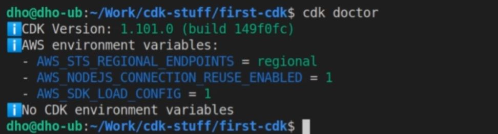

# AWS + TS Masterclass

### Lesson 1 - AWS CDK and CloudFormation

Expand

##### 1.1 AWS CDK cool presentation
1. Things to remember
    1. CDK is
        1. Reuseable version of CloudFormation
        1. Easier to read than CloudFormation
        1. Available in
            1. Python
            1. C#
            1. TS

##### 1.2 AWS CloudFormation
1. Verify if CDK is properly running
    1. AWS CLI
        1. 
    1. AWS CDK
        1. 

1. Initialize within TS
    1. 
        1. `cdk init app --language typescript`
1. Define your Stack within initialized folder
    1. `bin` folder
        1. place where cdk is initialized with `new cdk.App()`
        1. 
    1. `lib` folder 
        1. place where `CdkStack` is defined
        1. 
        1. 
    1. `jest.config.js`
        1. 
1. `cdk synth` to generate CloudFront `.json` files
    1. 
        1.  
1. `cdk bootstrap` to send the stack to your AWS account
    1. 
        1. 
1. `cdk deploy`
    1. 
        1. 

##### 1.4 CDK Project exploration
1. CDK configuration file - `cdk.json`
    1. 
        1.  `"app"` holds the running command when CDK starts
        1. note that it runs `ts-node` which DOES NOT read JS... just pure TS
1. `bin` cdk.ts
    1. 
        1.  This is where deployment properties are set
    1. Also you can deploy MULTIPLE stacks from this file
        1. 
            1. 
1. `lib` stack.ts
    1. 
        1.  This is where stack definitions go

1. Inserting custom CDK S3 commands
    1. Install S3 library
        1. 
    1. Import
        1. 
    1. Implement
        1. 
    1. Merely adding `{}` allows to pull a list of CDK properties
        1. 
    1. Don't forget to import 
        1. 
    1. `cdk deploy`

##### 1.5 AWS CDK types and commands
1. `cdk deploy`
    1. `cdk deploy SpecificStack` 
        1. 
    1. 
        1. 
1. `cdk list`
    1. lists available stacks IN THE `cdk.out`
        1. 
    1. 
1. `cdk diff`
    1. shows recent changes in bucket
        1. 
1. `cdk destroy`
    1. destroys SPECIFIED stack
        1. 
        1. 
1. `cdk doctor`
    1. tells us if there are problems with stacks
        1. 

##### 1.6 AWS CDK outputs
1. What are outputs?
    1. Metadata about name of generated stack resources
        1. allows you to recall names of stack resources WITHOUT having to go through the console
1. What does an output look like?
    1. In code
        1. 
    1. In output
        1. 
    1. In AWS Console
        1. 

##### 1.7 CDK Deployment parameters
1. What are Parameters
    1. Allows for changes to stacks that are already deployed
1. Import and utilize
    1. 
    1.  
1. Checking output in AWS Console
    1. 
        1. 
1. Changing a parameter mid-deployment
    1. 
        1. 

##### 1.8 CDK core - recap
1. Best Reference when using AWS CDK... AWS CDK API reference
    1. 
1. All reference are `aws-nameOfAWSresource`
    1. 
1. Other Reference ... AWS CDK github page
    1. Always check for issues
        1. 

### Lesson 2 - Serverless project with CDK and TS

Expand

##### 2.1 AWS CDK Typescript project from scratch
1. What is good about CDK v2
    1. Allows for all constructs to be imported via one package

##### 2.2 CDK project implementation - part 2
1. Overview of starting a CDK project
    1. initialize GitHub project / checkout locally
    1. `npm init -y`
    1. `npm i -D aws-ckd aws-cdk-lib constructs ts-node typescript`
    1. create a separate folder holding the logic of CDK files
        1. folder
            1. 
        1. Stack configuration
            1. 
    1. modify `cdk.json`
        1. ` {
           "app":"npx infrastructure/Launcher.ts" 
        }`
            1. 
    1. `synth` to get `tsconfig`
1. 
    1. 
        1. 
            1. 
    1. 
        1. 
            1. 

1. 
    1. 
        1. 
            1. 
    1. 
        1. 
            1. 
1. 
    1. 
        1. 
            1. 
    1. 
        1. 
            1. 

1. 
    1. 
        1. 
            1. 
    1. 
        1. 
            1. 
1. 
    1. 
        1. 
            1. 
    1. 
        1. 
            1. 

1. 
    1. 
        1. 
            1. 
    1. 
        1. 
            1. 

##### 2.3 Basic AWS Lambda
1. 
    1. 
        1. 
            1. 
    1. 
        1. 
            1. 

1. 
    1. 
        1. 
            1. 
    1. 
        1. 
            1. 

##### 2.4 AWS API Gateway and Lambda
1. 
    1. 
        1. 
            1. 
    1. 
        1. 
            1. 

1. 
    1. 
        1. 
            1. 
    1. 
        1. 
            1. 

##### 2.5 AWS DynamoDB with CDK
1. 
    1. 
        1. 
            1. 
    1. 
        1. 
            1. 

1. 
    1. 
        1. 
            1. 
    1. 
        1. 
            1. 

### Lesson 3 - AWS CDK and CloudFormation

Expand

##### 3.1 Section intro
1. 
    1. 
        1. 
            1. 
    1. 
        1. 
            1. 

1. 
    1. 
        1. 
            1. 
    1. 
        1. 
            1. 

##### 3.1 Lambda bundling problem
1. 
    1. 
        1. 
            1. 
    1. 
        1. 
            1. 

1. 
    1. 
        1. 
            1. 
    1. 
        1. 
            1. 

##### 3.1 CDK Node Lambda
1. 
    1. 
        1. 
            1. 
    1. 
        1. 
            1. 

1. 
    1. 
        1. 
            1. 
    1. 
        1. 
            1. 

            
##### 3.1 Webpack intro
1. 
    1. 
        1. 
            1. 
    1. 
        1. 
            1. 

1. 
    1. 
        1. 
            1. 
    1. 
        1. 
            1. 

##### 3.1 Lambda Webpack setup
1. 
    1. 
        1. 
            1. 
    1. 
        1. 
            1. 

1. 
    1. 
        1. 
            1. 
    1. 
        1. 
            1. 

### Lesson 4 Testing and debugging Lambdas

Expand

##### 4.1 Section intro
1. 
    1. 
        1. 
            1. 
    1. 
        1. 
            1. 

1. 
    1. 
        1. 
            1. 
    1. 
        1. 
            1. 

##### 4.1 AWS CloudWatch logs
1. 
    1. 
        1. 
            1. 
    1. 
        1. 
            1. 

1. 
    1. 
        1. 
            1. 
    1. 
        1. 
            1. 

##### 4.1 Using the AWS sdk
1. 
    1. 
        1. 
            1. 
    1. 
        1. 
            1. 

1. 
    1. 
        1. 
            1. 
    1. 
        1. 
            1. 

### Lesson 5 AWS DynamodBD with CDK and Lambda

Expand

##### 5.1 Section intro
1. 
    1. 
        1. 
            1. 
    1. 
        1. 
            1. 

1. 
    1. 
        1. 
            1. 
    1. 
        1. 
            1. 

##### 5.2 Put item
1. 
    1. 
        1. 
            1. 
    1. 
        1. 
            1. 

1. 
    1. 
        1. 
            1. 
    1. 
        1. 
            1. 

##### 5.3 Getting data from ApiGateway
1. 
    1. 
        1. 
            1. 
    1. 
        1. 
            1. 

1. 
    1. 
        1. 
            1. 
    1. 
        1. 
            1. 

##### 5.4 DynamoDb lambda initial setup
1. 
    1. 
        1. 
            1. 
    1. 
        1. 
            1. 

1. 
    1. 
        1. 
            1. 
    1. 
        1. 
            1. 

##### 5.5 DynamoDb lambda finish
1. 
    1. 
        1. 
            1. 
    1. 
        1. 
            1. 

1. 
    1. 
        1. 
            1. 
    1. 
        1. 
            1. 

##### 5.6 Scan operation
1. 
    1. 
        1. 
            1. 
    1. 
        1. 
            1. 

1. 
    1. 
        1. 
            1. 
    1. 
        1. 
            1. 

##### 5.7 Query operation
1. 
    1. 
        1. 
            1. 
    1. 
        1. 
            1. 

1. 
    1. 
        1. 
            1. 
    1. 
        1. 
            1. 

##### 5.8 Query on secondary indexes
1. 
    1. 
        1. 
            1. 
    1. 
        1. 
            1. 

1. 
    1. 
        1. 
            1. 
    1. 
        1. 
            1. 

##### 5.9 Update operation
1. 
    1. 
        1. 
            1. 
    1. 
        1. 
            1. 

1. 
    1. 
        1. 
            1. 
    1. 
        1. 
            1. 

##### 5.10 Delete operation
1. 
    1. 
        1. 
            1. 
    1. 
        1. 
            1. 

1. 
    1. 
        1. 
            1. 
    1. 
        1. 
            1. 

##### 5.11 Data validation
1. 
    1. 
        1. 
            1. 
    1. 
        1. 
            1. 

1. 
    1. 
        1. 
            1. 
    1. 
        1. 
            1. 

##### 5.12 Project small fixes
1. 
    1. 
        1. 
            1. 
    1. 
        1. 
            1. 

1. 
    1. 
        1. 
            1. 
    1. 
        1. 
            1. 

### Lesson 6 Securing API's with AWS Cognito

Expand

##### 6.1 Section intro
1. 
    1. 
        1. 
            1. 
    1. 
        1. 
            1. 

1. 
    1. 
        1. 
            1. 
    1. 
        1. 
            1. 

##### 6.2 AWS Cognito presentation
1. 
    1. 
        1. 
            1. 
    1. 
        1. 
            1. 

1. 
    1. 
        1. 
            1. 
    1. 
        1. 
            1. 

##### 6.3 Cognito in the AWS console
1. 
    1. 
        1. 
            1. 
    1. 
        1. 
            1. 

1. 
    1. 
        1. 
            1. 
    1. 
        1. 
            1. 

##### 6.4 Generating JWT tokens with AWS Amplify
1. 
    1. 
        1. 
            1. 
    1. 
        1. 
            1. 

1. 
    1. 
        1. 
            1. 
    1. 
        1. 
            1. 

##### 6.5 Using AWS Cognito tokens
1. 
    1. 
        1. 
            1. 
    1. 
        1. 
            1. 

1. 
    1. 
        1. 
            1. 
    1. 
        1. 
            1. 

##### 6.6 Understanding JWT tokens
1. 
    1. 
        1. 
            1. 
    1. 
        1. 
            1. 

1. 
    1. 
        1. 
            1. 
    1. 
        1. 
            1. 

##### 6.7 AWS Cognito with CDK: UserPool
1. 
    1. 
        1. 
            1. 
    1. 
        1. 
            1. 

1. 
    1. 
        1. 
            1. 
    1. 
        1. 
            1. 

##### 6.8 AWS Cognito with CDK: UserPoolClient
1. 
    1. 
        1. 
            1. 
    1. 
        1. 
            1. 

1. 
    1. 
        1. 
            1. 
    1. 
        1. 
            1. 

##### 6.9 Testing CDK with Cognito
1. 
    1. 
        1. 
            1. 
    1. 
        1. 
            1. 

1. 
    1. 
        1. 
            1. 
    1. 
        1. 
            1. 

##### 6.10 Access control with Cognito groups
1. 
    1. 
        1. 
            1. 
    1. 
        1. 
            1. 

1. 
    1. 
        1. 
            1. 
    1. 
        1. 
            1. 

### Lesson 7 AWS Cognito Identity pools

Expand

##### 7.1 Section intro
1. 
    1. 
        1. 
            1. 
    1. 
        1. 
            1. 

1. 
    1. 
        1. 
            1. 
    1. 
        1. 
            1. 

##### 7.2 AWS Cognito Identity pools in the console
1. 
    1. 
        1. 
            1. 
    1. 
        1. 
            1. 

1. 
    1. 
        1. 
            1. 
    1. 
        1. 
            1. 

##### 7.3 Getting AWS temporary credentials
1. 
    1. 
        1. 
            1. 
    1. 
        1. 
            1. 

1. 
    1. 
        1. 
            1. 
    1. 
        1. 
            1. 

##### 7.4 Identity pools in CDK
1. 
    1. 
        1. 
            1. 
    1. 
        1. 
            1. 

1. 
    1. 
        1. 
            1. 
    1. 
        1. 
            1. 

##### 7.5 IAM roles in CDK
1. 
    1. 
        1. 
            1. 
    1. 
        1. 
            1. 

1. 
    1. 
        1. 
            1. 
    1. 
        1. 
            1. 

##### 7.6 IAM role mappings
1. 
    1. 
        1. 
            1. 
    1. 
        1. 
            1. 

1. 
    1. 
        1. 
            1. 
    1. 
        1. 
            1. 

##### 7.7 Testing AWS temporary credentials
1. 
    1. 
        1. 
            1. 
    1. 
        1. 
            1. 

1. 
    1. 
        1. 
            1. 
    1. 
        1. 
            1. 

##### 7.8 Further features of AWS Cognito
1. 
    1. 
        1. 
            1. 
    1. 
        1. 
            1. 

1. 
    1. 
        1. 
            1. 
    1. 
        1. 
            1. 

### Lesson 8 Front-end for our Backend with React

Expand

##### 8.1 Section intro
1. 
    1. 
        1. 
            1. 
    1. 
        1. 
            1. 

1. 
    1. 
        1. 
            1. 
    1. 
        1. 
            1. 

##### 8.2 Create react app and git
1. 
    1. 
        1. 
            1. 
    1. 
        1. 
            1. 

1. 
    1. 
        1. 
            1. 
    1. 
        1. 
            1. 

##### 8.3 Base project structure
1. 
    1. 
        1. 
            1. 
    1. 
        1. 
            1. 

1. 
    1. 
        1. 
            1. 
    1. 
        1. 
            1. 

##### 8.4 Understanding state and props, child, parent
1. 
    1. 
        1. 
            1. 
    1. 
        1. 
            1. 

1. 
    1. 
        1. 
            1. 
    1. 
        1. 
            1. 

##### 8.5 First class component
1. 
    1. 
        1. 
            1. 
    1. 
        1. 
            1. 

1. 
    1. 
        1. 
            1. 
    1. 
        1. 
            1. 

##### 8.6 Child components
1. 
    1. 
        1. 
            1. 
    1. 
        1. 
            1. 

1. 
    1. 
        1. 
            1. 
    1. 
        1. 
            1. 

##### 8.7 Handling events
1. 
    1. 
        1. 
            1. 
    1. 
        1. 
            1. 

1. 
    1. 
        1. 
            1. 
    1. 
        1. 
            1. 

##### 8.8 Conditional rendering
1. 
    1. 
        1. 
            1. 
    1. 
        1. 
            1. 

1. 
    1. 
        1. 
            1. 
    1. 
        1. 
            1. 

##### 8.9 Data from child to parent
1. 
    1. 
        1. 
            1. 
    1. 
        1. 
            1. 

1. 
    1. 
        1. 
            1. 
    1. 
        1. 
            1. 

##### 8.10 Routing - NavBar
1. 
    1. 
        1. 
            1. 
    1. 
        1. 
            1. 

1. 
    1. 
        1. 
            1. 
    1. 
        1. 
            1. 

##### 8.11 Routing - Router
1. 
    1. 
        1. 
            1. 
    1. 
        1. 
            1. 

1. 
    1. 
        1. 
            1. 
    1. 
        1. 
            1. 

##### 8.12 Small Css
1. 
    1. 
        1. 
            1. 
    1. 
        1. 
            1. 

1. 
    1. 
        1. 
            1. 
    1. 
        1. 
            1. 

##### 8.13 State of the app
1. 
    1. 
        1. 
            1. 
    1. 
        1. 
            1. 

1. 
    1. 
        1. 
            1. 
    1. 
        1. 
            1. 

##### 8.14 Rendering async table: setup
1. 
    1. 
        1. 
            1. 
    1. 
        1. 
            1. 

1. 
    1. 
        1. 
            1. 
    1. 
        1. 
            1. 

##### 8.15 Rendering async table: adding rows
1. 
    1. 
        1. 
            1. 
    1. 
        1. 
            1. 

1. 
    1. 
        1. 
            1. 
    1. 
        1. 
            1. 

##### 8.16 Space component build
1. 
    1. 
        1. 
            1. 
    1. 
        1. 
            1. 

1. 
    1. 
        1. 
            1. 
    1. 
        1. 
            1. 

##### 8.17 Spaces component
1. 
    1. 
        1. 
            1. 
    1. 
        1. 
            1. 

1. 
    1. 
        1. 
            1. 
    1. 
        1. 
            1. 

##### 8.18 Routing and stiling spaces
1. 
    1. 
        1. 
            1. 
    1. 
        1. 
            1. 

1. 
    1. 
        1. 
            1. 
    1. 
        1. 
            1. 

##### 8.19 Modal content
1. 
    1. 
        1. 
            1. 
    1. 
        1. 
            1. 

1. 
    1. 
        1. 
            1. 
    1. 
        1. 
            1. 

##### 8.20 Display modal
1. 
    1. 
        1. 
            1. 
    1. 
        1. 
            1. 

1. 
    1. 
        1. 
            1. 
    1. 
        1. 
            1. 

### Lesson 9 Using AWS inside a React Project with Ampify

Expand

##### 9.1 Section intro
1. 
    1. 
        1. 
            1. 
    1. 
        1. 
            1. 

1. 
    1. 
        1. 
            1. 
    1. 
        1. 
            1. 

##### 9.2  Setup and Amplify install
1. 
    1. 
        1. 
            1. 
    1. 
        1. 
            1. 

1. 
    1. 
        1. 
            1. 
    1. 
        1. 
            1. 

##### 9.3 Cognito login from React code
1. 
    1. 
        1. 
            1. 
    1. 
        1. 
            1. 

1. 
    1. 
        1. 
            1. 
    1. 
        1. 
            1. 

##### 9.4 Amplify issue solved
1. 
    1. 
        1. 
            1. 
    1. 
        1. 
            1. 

1. 
    1. 
        1. 
            1. 
    1. 
        1. 
            1. 

##### 9.5 Photo bucket name and bucket CORS
1. 
    1. 
        1. 
            1. 
    1. 
        1. 
            1. 

1. 
    1. 
        1. 
            1. 
    1. 
        1. 
            1. 

##### 9.6 Passing the bucket ARN to Auth
1. 
    1. 
        1. 
            1. 
    1. 
        1. 
            1. 

1. 
    1. 
        1. 
            1. 
    1. 
        1. 
            1. 

##### 9.7 Lambda CORS
1. 
    1. 
        1. 
            1. 
    1. 
        1. 
            1. 

1. 
    1. 
        1. 
            1. 
    1. 
        1. 
            1. 

##### 9.8 Create space component
1. 
    1. 
        1. 
            1. 
    1. 
        1. 
            1. 

1. 
    1. 
        1. 
            1. 
    1. 
        1. 
            1. 

##### 9.9 AWS credentials in the browser
1. 
    1. 
        1. 
            1. 
    1. 
        1. 
            1. 

1. 
    1. 
        1. 
            1. 
    1. 
        1. 
            1. 

##### 9.10 Uploading public files
1. 
    1. 
        1. 
            1. 
    1. 
        1. 
            1. 

1. 
    1. 
        1. 
            1. 
    1. 
        1. 
            1. 

##### 9.11 Creating spaces
1. 
    1. 
        1. 
            1. 
    1. 
        1. 
            1. 

1. 
    1. 
        1. 
            1. 
    1. 
        1. 
            1. 

##### 9.12 Getting spaces
1. 
    1. 
        1. 
            1. 
    1. 
        1. 
            1. 

1. 
    1. 
        1. 
            1. 
    1. 
        1. 
            1. 

### Lesson 10 Application Deployment

Expand

##### 10.2 Section intro
1. 
    1. 
        1. 
            1. 
    1. 
        1. 
            1. 

1. 
    1. 
        1. 
            1. 
    1. 
        1. 
            1. 

##### 10.3 Deployment To S3 and CloudFront
1. 
    1. 
        1. 
            1. 
    1. 
        1. 
            1. 

1. 
    1. 
        1. 
            1. 
    1. 
        1. 
            1. 

##### 10.4 Discussion about finishing
1. 
    1. 
        1. 
            1. 
    1. 
        1. 
            1. 

1. 
    1. 
        1. 
            1. 
    1. 
        1. 
            1. 

##### 10.5 Exploring the finished app
1. 
    1. 
        1. 
            1. 
    1. 
        1. 
            1. 

1. 
    1. 
        1. 
            1. 
    1. 
        1. 
            1. 

### Lesson 11 Advanced usecases

Expand

##### 2.1 Intro
1. 
    1. 
        1. 
            1. 
    1. 
        1. 
            1. 

1. 
    1. 
        1. 
            1. 
    1. 
        1. 
            1. 

AWS recap
TS recap

